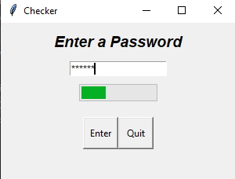

# Read Me
This is a simple Python application that checks the strength of a password entered by the user. It provides visual feedback through a progress bar and saves the password if it meets the strength criteria.
# Usage
run " python Checker.py " in terminal
# Example 

## Author
Furkan Sarsilmaz